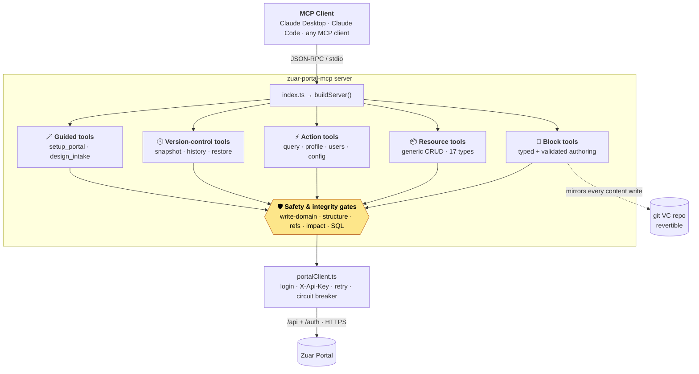
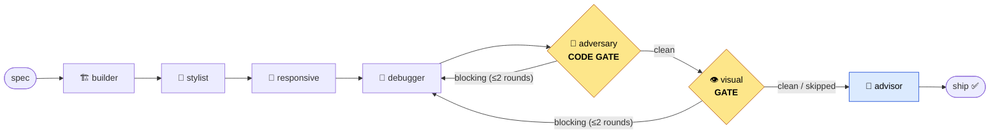
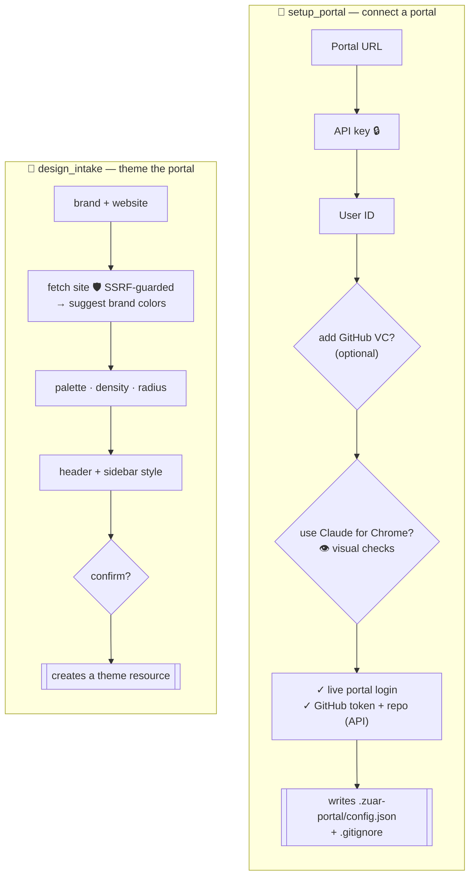
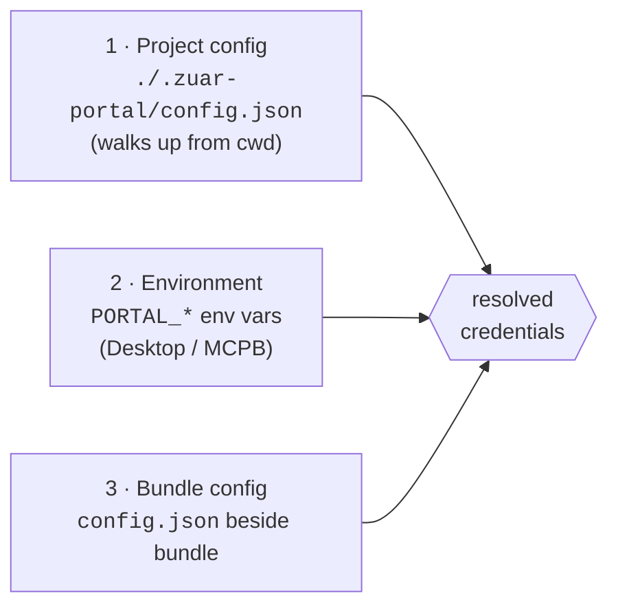

<div align="center">

# Zuar Portal — MCP Server

**Let Claude operate your [Zuar Portal](https://www.zuar.com/) (zPortal) for you** — author HTML blocks, build pages, manage data sources, queries, themes and users, explore real data, and keep a git-versioned, revertible history of every change, all through natural language.

[](https://github.com/patrickdeanfox/zuar-portal-mcp/releases/latest)
[-5A45FF)](https://modelcontextprotocol.io)
[](https://www.zuar.com/)
[](docs/03-tools-reference.md)
[](#-install--claude-desktop-one-click)
[](LICENSE)

</div>

---

An [MCP](https://modelcontextprotocol.io) server that exposes a Zuar Portal's REST + auth APIs to any MCP client (Claude Desktop, Claude Code, …). It turns *"build me a sales dashboard"* into the right sequence of authenticated calls — discover data sources → write a saved query → author a **validated** HTML block → bind it → place it on a page — with bundled authoring guidance, layered write-safety, and a revertible history.

> [!TIP]
> **Quick install (Claude Desktop):** download **`zuar-portal-mcp.mcpb`** from the [latest release](https://github.com/patrickdeanfox/zuar-portal-mcp/releases/latest) and double-click it. You'll be asked for three portal values — no terminal, no config files. [Jump to install ↓](#-install--claude-desktop-one-click)

## At a glance



Every write is tagged with a **risk domain** and passes the safety gates *before* anything reaches the portal; every successful **content** write is mirrored to a git repo so it can be reverted.

## Contents

- [Highlights](#highlights)
- [What Claude can do with it](#what-claude-can-do-with-it) — the 44-tool catalog
- [The Claude Code agent ecosystem](#the-claude-code-agent-ecosystem) — pipeline, agents, model/effort routing
- [Guided onboarding & theming (elicitation)](#guided-onboarding--theming-elicitation)
- [Requirements & credentials](#requirements)
- [🖱️ Install — Claude Desktop (one-click)](#install--claude-desktop-one-click)
- [⌨️ Install — Claude Code & other clients](#install--claude-code--other-mcp-clients)
- [Per-project configuration (multiple portals)](#per-project-configuration-multiple-portals)
- [Getting started](#getting-started)
- [Write safety & tool gating](#write-safety--tool-gating)
- [Resilience, observability & hardening](#resilience-observability--hardening)
- [Troubleshooting](#troubleshooting) · [Development](#development) · [Bundle](#building-the-mcpb-bundle) · [Security](#security) · [License](#license)

> [!NOTE]
> **📚 Full documentation** lives in **[`docs/`](docs/README.md)** — overview, install & config, a reference for all 44 tools, block authoring, the design system, version control, the in-block `zPortal` API, the [agent ecosystem & model routing](docs/13-agents-and-workflows.md), [tool gating](docs/14-tool-gating-and-guidance.md), [safety gates](docs/16-safety-and-integrity.md), and troubleshooting.

## Highlights

| | |
|---|---|
| 🖱️ **One-click install** | A signed `.mcpb` bundle for Claude Desktop — fill in three fields, no terminal. |
| 🧱 **Validated authoring** | HTML blocks go through dedicated, rule-checked tools (`create_block`/`update_block`/`validate_block`) — footguns are caught *before* the portal is touched. |
| 🏢 **Multi-portal, multi-repo** *(v2.4.0)* | One install drives a **different portal + git repo per folder** via `./.zuar-portal/config.json`. |
| 🪄 **Guided, no-JSON setup** *(v2.8.0)* | `setup_portal` and `design_intake` prompt you field-by-field (elicitation), validate live, and write config / create a theme for you. |
| 🤝 **A team of agents** | In Claude Code, a gated **build → style → responsive → debug → adversary → advisor** pipeline of specialist subagents builds blocks for you — each on a [right-sized model](#model--effort-routing). |
| 🔒 **Enterprise safety** *(v2.5–2.6)* | Risk-domain write gating, least-privilege tool scoping, structural + referential integrity gates, pre-delete impact analysis, and an opt-in audit log. |
| 🕓 **Revertible history** *(v2.2.0)* | Every content write mirrors to a git repo — revert any change with `restore_resource`. |

---

## What Claude can do with it

**44 tools** across five groups. The full per-tool reference (params, risk domain, examples) is in **[docs/03 · Tools Reference](docs/03-tools-reference.md)**.

### 🧱 Block tools — typed + validated

| Tool | What it does |
|------|--------------|
| `list_blocks` | List blocks on the portal (optionally by ID, or names only). |
| `get_block` | Fetch one block by UUID, including its HTML/CSS and query config. |
| `create_block` | Create an HTML block (validated against authoring rules). |
| `update_block` | Update an HTML block — merged over the current block so untouched fields survive. |
| `delete_block` | Delete a block by UUID. |
| `validate_block` | Run the authoring rules against a block payload **without writing** — iterate until clean. |
| `bind_block_query` | Bind a block to a datasource/query (auto-creates the query); sets `ui_queries`. |
| `add_block_to_page` | Place a block on a page (layout grid). |
| `set_page_blocks` | Place **many** blocks on a page in one atomic write (no lost-update race). |
| `remove_block_from_page` | Take a block off a page without deleting the block. |

<details>
<summary><b>📦 Generic resource tools</b> — one CRUD surface over 17 resource types</summary>

Pass `resource` plus a `body`/`id`. Call `describe_resource` to see each resource's fields, required-to-create fields, supported verbs, and risk domain.

| Tool | What it does |
|------|--------------|
| `describe_resource` | List resources, or describe one (fields, verbs, domain). |
| `list_resource` | List records — e.g. `resource: "datasource"` for discovery. |
| `get_resource` | Get one record by id. |
| `create_resource` | Create a record (write-gated by domain). |
| `update_resource` | Update a record (merged over current; write-gated). |
| `delete_resource` | Delete a record (write-gated; pre-delete impact analysis). |

**Covered resources:** `layout` (pages), `datasource`, `query`, `db_modification`, `partial`, `theme`, `snippet`, `translation`, `dashboard`, `tag`, `user`, `group`, `permission`, `access_policy`, `api_key`, `credential`, `system`.

> Blocks are intentionally **not** in this registry — they get typed, validated tools of their own so authoring can be guarded by `validateBlock`.

</details>

<details>
<summary><b>⚡ Action tools</b> — data exploration, users, config, version control & guided setup</summary>

| Tool | What it does | Domain |
|------|--------------|--------|
| `fetch_sample_rows` | Preview rows from a datasource to wire blocks to real columns. | read |
| `profile_datasource` | Per-column stats (type, distinct values, min/max) to design filters + charts. | read |
| `execute_query` | Run a saved query by id and return results (optional row `limit`). | read |
| `run_db_modification` | Run a saved DB write by name. Needs `confirm: true`. | data |
| `change_password` | Change the current user's password. | admin |
| `get_user_groups` / `set_user_groups` | Read / replace a user's group membership. | read / admin |
| `get_user_permissions` / `set_user_permissions` | Read / replace a user's permissions. | read / admin |
| `get_me` / `update_me` | Read / update the current user's profile. | read / admin |
| `get_config` / `update_config` | Read / set portal config by path. | read / admin |
| `get_version` | Portal version + about (capability check). | read |
| `get_rules` | Show active block-authoring rules. | read |
| `suggest_name` / `parse_name` | The `scope · kind · subject` naming grammar — propose and decompose names. | read |
| `validate_portal` | Read-only sweep for malformed records, dangling refs, and risky SQL. | read |
| `get_capabilities` | Report the current posture — enabled/disabled tool groups, write-safety, VC + audit status, active portal *(always available)*. | read |
| `get_metrics` | Per-tool call count, error rate, latency, uptime, breaker state *(always available)*. | read |
| `active_config` | Report which project config / portal / VC repo is in effect (secrets redacted). | read |
| **`setup_portal`** | **Guided** setup — prompts (elicitation) for portal creds + optional GitHub VC, validates both live, then writes `./.zuar-portal/config.json`. | setup |
| `init_project_config` | Write this folder's `./.zuar-portal/config.json` for a specific portal (+ optional VC) and validate it. | setup |
| **`design_intake`** | **Guided theming** — prompts for brand/website, colors, density, radius, header/sidebar; fetches the site (SSRF-guarded) to suggest colors; synthesizes a token map and, on confirm, creates a `theme`. | design |

</details>

<details>
<summary><b>🕓 Version-control tools</b> — snapshot, history, restore <i>(v2.2.0)</i></summary>

| Tool | What it does |
|------|--------------|
| `vc_status` | Show whether VC is configured and the repo state. |
| `snapshot_portal` | Commit the full current portal state to the git repo — a durable checkpoint. |
| `vc_log` | Show the commit history of content changes. |
| `restore_resource` | Restore a resource to a previous committed version. |

See **[docs/07 · Version Control](docs/07-version-control.md)**.

</details>

**Resources** (`zportal://guide/*`) — authoring guidance Claude reads *before* building, so blocks follow zPortal conventions even on a fresh machine: `block-structure`, `currentblock`, `amcharts-loader`.

**Prompts** — `zuar_portal_quickstart` (orient → route), `create_zportal_block` (discover → build → create), `setup_zuar_project` (connect this folder, routes to `setup_portal`).

---

## The Claude Code agent ecosystem

When this repo is your Claude Code working directory, the MCP tools come with a **team of specialists** in [`.claude/`](.claude/README.md). You don't drive `create_block`/`bind_block_query` by hand — you describe what you want, and a gated pipeline builds, styles, hardens, and reviews it. Full guide: **[docs/13 · Agents & Workflows](docs/13-agents-and-workflows.md)**.

### The block pipeline

Blocks are **never shipped raw**. A spec flows through quality gates, each a focused subagent:



The **adversary** (gate) red-teams the block and proves each finding with evidence; while it returns blocking findings the pipeline loops back to the **debugger**. The **visual gate** (the adversary with browser eyes) then *opens the rendered block in Claude for Chrome* — screenshot, console, network — and a blank render, console error, sample-not-live data, or overflow loops back to the debugger too; it's **best-effort** and skips with a note when the extension isn't connected or the block isn't on a page. The **advisor** asks "is this the *right* block?" All gates are **read-only** — they carry no write tools and physically cannot mutate the portal (browsing/screenshotting is read-only). Beyond the six pipeline agents, four **specialists** handle broader jobs: `portal-data-expert`, `portal-theme-designer`, `portal-bulk-operator` (snapshot-first), and `portal-onboarding`.

### Seeing the portal (Claude for Chrome)

Every gate above reasons about a block from its **code and query rows** — but a block can validate, bind, and still render blank, throw a runtime console error, overflow its grid cell, or silently show its hardcoded **sample** fallback instead of live data. With the **[Claude for Chrome](https://www.anthropic.com/claude-in-chrome)** extension connected, the agents can *see* the portal: open the page, screenshot the block, and read the browser console/network — for **visual debugging** and a final **visual sign-off**.

- **Recorded at setup.** `setup_portal` asks whether you use Claude for Chrome and stores `browser.claudeInChrome` in `./.zuar-portal/config.json`; `active_config` / `get_capabilities` report it.
- **Used where it pays.** The debugger looks before it guesses; the adversary owns the **visual gate**; the stylist and responsive-specialist screenshot their work (the latter steps widths with `resize_window`); the advisor checks it reads at a glance.
- **Sign-in caveat.** The MCP authenticates with an **API key**, but the browser needs a **logged-in session** — to view private pages you must be **signed into your portal in Chrome**. The MCP can't log you in.
- **Graceful by design.** No extension, or the block isn't on a page? Every agent falls back to code-only review and says so. The doctrine lives in the `zportal://guide/visual-verification` resource.

### Slash commands

| Command | What it runs |
|---|---|
| `/portal-setup` | First-time per-folder setup + alignment Q&A → config + project brief. |
| `/portal-build <spec>` | The full build→style→responsive→debug→adversary→advisor pipeline for one block. |
| `/portal-theme <goal>` | Design or apply a portal-wide theme. |
| `/portal-bulk <change>` | A guarded bulk change across many blocks/pages (snapshot → dry-run → atomic apply). |
| `/portal-audit [filter]` | Read-only audit of existing blocks — bugs, a11y, responsiveness, design fit. |
| `/portal-align` | Run the alignment Q&A on its own. |

### Model & effort routing

Each agent runs on the **model and reasoning effort** that fit its job — sharp where judgment matters, cheap where the work is mechanical. Three composing layers:

**1 · Agent defaults** (`model:`/`effort:` frontmatter) — for a *direct* call (a fast surgical edit, or one agent dispatched from a command):

| Tier | Agents | Model · effort |
|---|---|---|
| 🧠 **Judgment / data** | data-expert, adversary, advisor | **`opus` · high** |
| 🛠️ **Authoring** | builder, stylist, debugger, bulk-operator, theme-designer, onboarding | **`sonnet` · medium** |
| ⚡ **Mechanical** | responsive-specialist | **`haiku` · low** |

**2 · Workflow `tier` toggle** — `portal-block-pipeline.js` and `portal-audit.js` take `args:{ …, tier }` and set each stage's model/effort explicitly:

| `tier` | For… | Builders | Judgment gates |
|---|---|---|---|
| **`fast`** | cheap iteration, throwaway drafts, triage | sonnet/haiku · low | sonnet · medium |
| **`standard`** *(default)* | a normal build / audit | sonnet · medium | **opus · high** |
| **`max`** | production / executive build, pre-release audit | **opus · high** | **opus · xhigh** |

**3 · Commands** pin to **`sonnet` · medium** — they only orchestrate (pre-flight → dispatch → synthesize); quality lives in the agents/workflow they call. `/portal-build` and `/portal-audit` infer the `tier` from your phrasing.

> The MCP **server** never selects a model — only the agents, commands, and workflows that drive it do. Re-tier via agent frontmatter or a workflow's `ROUTING` table; see [`.claude/README.md`](.claude/README.md).

---

## Guided onboarding & theming (elicitation)

On a client that supports **[elicitation](https://modelcontextprotocol.io)** (Claude Desktop, Claude Code), two tools prompt you **field-by-field** instead of making you hand-edit JSON — and validate everything live before committing. If the client can't prompt, both fall back to argument-only mode.



- **`setup_portal`** refuses to clobber an existing config, validates with a real login, and writes a gitignored `./.zuar-portal/`. It also asks whether you use **Claude for Chrome** (stored as `browser.claudeInChrome`) so the build pipeline can *see* your blocks render — visual debugging + a final visual gate (see [Seeing the portal](#seeing-the-portal-claude-for-chrome)). The `setup_zuar_project` prompt and `/portal-setup` route to it; `init_project_config` is the direct, no-prompt equivalent.
- **`design_intake`** fetches the brand's website through an **SSRF-guarded** fetch to suggest a palette, then walks density/radius/header/sidebar and, on your confirmation, creates a `theme` resource.

---

## Requirements

- A **Zuar Portal** reachable over HTTPS, with an account that can manage blocks (admin recommended).
- **Claude Desktop** for the one-click `.mcpb` (Node ships with it) — or **Node.js 18+** for the developer / `npx` path.

### Getting your portal credentials

You need three values, entered once during install.

| # | Value | Where |
|---|-------|-------|
| 1 | **Portal URL** | The base URL, no trailing path — e.g. `https://your-portal.zuarbase.net`. |
| 2 | **Portal API Key** | **Admin → Auth → API Keys** → create/copy a key. It inherits its user's permissions — that user must be able to create/edit/delete blocks. |
| 3 | **Portal User ID** | **Admin → Users** → your user → copy the **UUID** from the page URL. |

> [!IMPORTANT]
> Keep the API Key and User ID private. In the Claude Desktop bundle they're declared **sensitive** (masked, stored securely) and never leave the machine running the server.

---

## Install — Claude Desktop (one-click)

1. Download **`zuar-portal-mcp.mcpb`** from the [latest release](https://github.com/patrickdeanfox/zuar-portal-mcp/releases/latest).
2. Double-click it, or drag it onto the Claude Desktop window. An install dialog appears.
3. Fill in **Portal URL**, **Portal API Key**, **Portal User ID** (and optionally the write-safety toggles).
4. Confirm. The tools, resources, and prompts are now available to Claude.

To update later, install a newer `.mcpb` over the old one.

## Install — Claude Code & other MCP clients

This server speaks MCP over **stdio**, so any MCP-capable client can use it. Provide the three values as environment variables.

**From a local clone (works today):**

```bash
git clone https://github.com/patrickdeanfox/zuar-portal-mcp.git
cd zuar-portal-mcp
npm install
npm run build      # compiles TypeScript -> dist/
```

Then register it in your client's MCP config (`claude_desktop_config.json`, or `.mcp.json` for Claude Code):

```json
{
  "mcpServers": {
    "zuar-portal-blocks": {
      "command": "node",
      "args": ["/absolute/path/to/zuar-portal-mcp/dist/index.js"],
      "env": {
        "PORTAL_URL": "https://your-portal.zuarbase.net",
        "PORTAL_API_KEY": "your-portal-api-key",
        "PORTAL_USER_ID": "your-portal-user-uuid"
      }
    }
  }
}
```

<details>
<summary>Via <code>npx</code> (once published to npm)</summary>

```json
{
  "mcpServers": {
    "zuar-portal-blocks": {
      "command": "npx",
      "args": ["-y", "zuar-portal-mcp-server"],
      "env": {
        "PORTAL_URL": "https://your-portal.zuarbase.net",
        "PORTAL_API_KEY": "your-portal-api-key",
        "PORTAL_USER_ID": "your-portal-user-uuid"
      }
    }
  }
}
```

</details>

---

## Per-project configuration (multiple portals)

One MCP install can drive **a different portal — and a different git state-repo — in every folder**. At startup the server resolves credentials in layers, highest priority first:



Each field resolves independently, so a project file can override just the portal while inheriting the rest. Empty values are ignored, so a blank Desktop field never shadows a project value. The file uses one schema for both the portal and its VC repo:

```json
{
  "portal": { "url": "https://team-a.zuarbase.net", "apiKey": "…", "userId": "…" },
  "vc":     { "dir": "/path/to/team-a-state", "push": true,
              "remote_url": "https://github.com/you/team-a-portal-state.git", "token": "…" }
}
```

**Set it up without hand-editing JSON:** ask Claude to run **`setup_portal`** (see [Guided onboarding ↑](#guided-onboarding--theming-elicitation)). `active_config` shows which portal/repo is in effect (secrets redacted). `./.zuar-portal/` is gitignored, so credentials are never committed.

---

## Getting started

Once installed, just talk to Claude:

1. **Confirm the connection** — *"List the datasources on my portal."* → `list_resource (datasource)`.
2. **Look at real data** — *"Show me a few sample rows from the Sales datasource."* → `fetch_sample_rows` (so Claude sees the real column names first).
3. **Create a block** — *"Create a stat-card block 'Total Orders' showing the order count from Sales."* → reads `zportal://guide/*`, builds the two-field block, `create_block`, reports the UUID.
4. **Iterate** — *"Make the number bigger and use the portal's primary color."* / *"Turn it into a bar chart of orders by state."* → `update_block`.

> [!TIP]
> In **Claude Code**, run **`/portal-build "a stat card of total orders from Sales"`** to push the spec through the whole gated pipeline, or invoke the **`create_zportal_block`** prompt for a structured discover → build → create flow.

---

## Write safety & tool gating

Every write is tagged with a **risk domain**, gated independently:

| Domain | Covers | Default | Enable with |
|--------|--------|---------|-------------|
| `content` | blocks, layouts, partials, themes, queries, snippets, translations, dashboards, tags | **on** | (on unless read-only) |
| `data` | datasources, db_modifications, `run_db_modification` | **off** | `PORTAL_ALLOW_DATA_WRITES=1` |
| `admin` | users, groups, permissions, access policies, API keys, credentials, system, config, passwords | **off** | `PORTAL_ALLOW_ADMIN_WRITES=1` |

- **`PORTAL_READONLY=1`** disables *every* write — reads and discovery still work.
- A blocked write returns a clear message naming the flag to set; nothing reaches the portal.
- `run_db_modification` additionally requires `confirm: true` on every call.
- Deletes and user/password mutations are marked **destructive** to MCP clients.

**Least-privilege tool scoping** *(v2.5.0)* — disable whole capability groups with `PORTAL_DISABLE_TOOLS=users,config`, or stand up a build-only allowlist with `PORTAL_ENABLE_TOOLS=blocks,resources,data` (deny wins).

**Integrity gates** *(v2.5–2.6, server-side, cannot be bypassed)* — every content write is checked for portal-compatible **structure** (a page missing `grid.layouts` is repaired or rejected) and dangling **references**; deletes run pre-delete **impact** analysis and refuse to orphan dependents unless `force=true`; user deletes refuse to remove the last admin; unscoped mass SQL needs `allow_unfiltered=true`. Run the read-only **`validate_portal`** anytime to sweep for problems. Full guide: [docs/16 · Safety & Integrity](docs/16-safety-and-integrity.md).

In the Claude Desktop bundle these are install-dialog toggles; for other clients set them as env vars. Deeper dive: [docs/14 · Tool Gating & Guidance](docs/14-tool-gating-and-guidance.md).

---

## Resilience, observability & hardening

Production-grade behaviour for a local, single-user server — safe defaults, no configuration required.

**Resilience** (the portal HTTP client every tool calls through):

| Behaviour | Default | Tune with |
|-----------|---------|-----------|
| Per-attempt timeout | 30 s | `PORTAL_TIMEOUT_MS` |
| Retries on transient failure (network, 408/425/429/5xx), exp. backoff + jitter, honouring `Retry-After` | 2 | `PORTAL_MAX_RETRIES`, `PORTAL_BACKOFF_BASE_MS`, `PORTAL_BACKOFF_MAX_MS` |
| Circuit breaker — fail fast while the upstream is down | opens after 5 failures, 15 s cooldown | `PORTAL_BREAKER_THRESHOLD`, `PORTAL_BREAKER_COOLDOWN_MS` |
| Max request body size | 5 MB | `PORTAL_MAX_BODY_BYTES` |
| Max tool input size (rejected at the MCP boundary) | 2 MB | `PORTAL_MAX_INPUT_BYTES` |

Retry safety: `GET` retries on any transient signal; writes retry only on a pre-response network error or explicit `429`/`503` — never on an ambiguous `502`/`504` that may already have applied.

**Observability** — every call gets a request id, latency, and an error tally. **`get_metrics`** (always-on) reports per-tool counts, error rate, latency, uptime, and the breaker state — metadata only, no payloads or secrets. Set **`PORTAL_LOG_FORMAT=json`** for structured stderr logs; **`PORTAL_AUDIT_LOG`** appends metadata-only JSONL for every content/data/admin write.

**Output secret redaction** — secret-bearing fields (`password`, `secret`, `token`, `api_key`, …) are masked as `[redacted]` on resource **reads**, so they never flow into the model's context. Identifier `*_id` fields are never masked; create/update responses are intact (so a freshly generated secret can be seen once). Disable with **`PORTAL_REDACT_SECRETS=0`**.

---

## Troubleshooting

| Symptom | Likely cause / fix |
|---------|--------------------|
| "Missing portal credentials: …" | One of `PORTAL_URL` / `PORTAL_API_KEY` / `PORTAL_USER_ID` is blank. Re-enter it. |
| "Portal login failed: HTTP 401/403" | Wrong API key or user ID, or the user lacks permission. Regenerate the key; confirm the user can manage blocks. |
| `list_resource (query)` says the endpoint isn't available | Your portal predates the saved-queries API (1.18+). Use `resource: "datasource"` — expected, not an error. |
| Tools don't appear in Claude | Reinstall the `.mcpb` / restart Claude Desktop. For the clone path, ensure `npm run build` succeeded and `args` points at `dist/index.js`. |
| Want to see what it's doing | Set `PORTAL_DEBUG=1` (or `PORTAL_LOG_FORMAT=json`). Logs go to **stderr** only. |
| "circuit breaker is open" | The upstream failed repeatedly; it auto-recovers after a short cooldown. `get_metrics` shows breaker state. |
| A stored secret returns `[redacted]` | Read redaction is on. Set `PORTAL_REDACT_SECRETS=0` for that session. |

More: [docs/12 · Troubleshooting](docs/12-troubleshooting.md).

---

## Development

```bash
npm install
npm run build                 # tsc -> dist/
PORTAL_DEBUG=1 npm start       # run locally on stdio (debug logs to stderr)
npm test                       # build + run the test suite (no portal/network needed)
npx @modelcontextprotocol/inspector node dist/index.js   # interactive testing
```

**Tests** (`npm test`, no credentials / no network): `rules.test.ts` (the block validator — each footgun rule + partial-update behaviour), `config.test.ts` (write-safety posture + tool-gating policy), `contract.test.ts` (end-to-end MCP contract: initialize, `tools/list`, input-schema rejection, validation, gating).

**Project layout:**

```
src/                 # MCP server source (compiled to dist/)
  index.ts           #   stdio entrypoint
  server.ts          #   tools, resources, prompts
  portalClient.ts    #   auth + request (login, X-Api-Key, retry, breaker)
  config.ts          #   layered credential resolution + write-safety + tool gating
  resources.ts       #   generic resource registry
  rules.ts           #   block authoring rules + validation
  structure.ts       #   structural write-gate (portal-breaking-shape guard)
  safety.ts          #   referential integrity, pre-delete impact, SQL/admin gates
  naming.ts          #   scope·kind·subject naming grammar
  design.ts / theme.ts / color.ts / website.ts  #   design system + design_intake
  github.ts          #   GitHub VC validation for setup_portal
  portalVc.ts        #   git version control of content writes
  guidance.ts        #   bundled authoring guidance (zportal://guide resources)
  observability.ts / redact.ts                  #   metrics + secret redaction
assets/              # runtime-loaded: conventions.md, design.md, rules.json
.claude/             # Claude Code agent ecosystem (agents, commands, skills, workflows)
docs/                # user documentation
reference/ context/  # API swagger + corpus + dev notes (not shipped in the .mcpb)
```

For local dev, drop a project config at `./.zuar-portal/config.json` (or run `init_project_config`) instead of env vars. `./.zuar-portal/` and any `config.json` are gitignored — never commit them.

## Building the .mcpb bundle

```bash
npm install -g @anthropic-ai/mcpb   # or: npx @anthropic-ai/mcpb <cmd>
npm install && npm run build
npm prune --omit=dev                # production node_modules only
mcpb validate manifest.json
mcpb pack                           # -> zuar-portal-mcp.mcpb
```

`.mcpbignore` excludes `src/`, dev files, local config, and the non-runtime `reference/`, `context/`, `.claude/` dirs. Attach the `.mcpb` to a GitHub Release for one-click install.

---

## Security

- Credentials are **never logged**. Debug output (gated by `PORTAL_DEBUG=1`) goes to stderr only, so it never corrupts the MCP stdio stream.
- The API Key and User ID are declared **sensitive** in the bundle manifest.
- The server talks only to the Portal URL you configure; the base URL is validated as a well-formed `http(s)` origin at startup. `design_intake`'s website fetch is **SSRF-guarded**.
- `create_block` / `update_block` are restricted to `type: "html"` and reject other types before any portal call.
- Secret-bearing fields are **redacted** from reads; tool inputs and request bodies are **size-capped**.

See **[`SECURITY.md`](SECURITY.md)** for the full posture: the per-tool-group data-touch matrix, credential handling, network egress, and data retention.

## License

[MIT](LICENSE).
