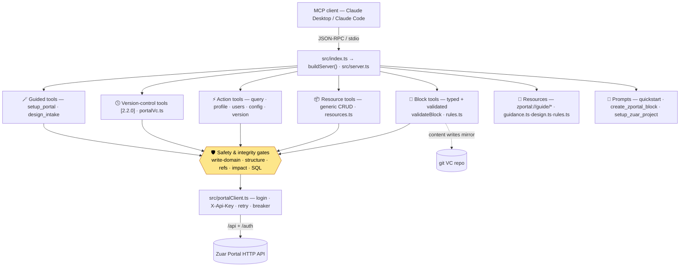

# 01 · Overview

## What it is
`zuar-portal-mcp` is a [Model Context Protocol](https://modelcontextprotocol.io) server that exposes a
Zuar Portal's REST surface to an MCP client (Claude Desktop, Claude Code, etc.). It turns "build me a
sales dashboard" into the right sequence of authenticated API calls — discovering datasources, writing
a saved query, authoring a validated HTML block, binding it, and placing it on a page — while keeping
guardrails around what can be written and a revertible history of what changed.

## Architecture at a glance

Every write also passes through three cross-cutting layers:
- **Write safety** (`src/config.ts`): each tool is tagged `content` / `data` / `admin`; a domain must
  be enabled before its writes are allowed. See [02 · Install & Configuration](02-install-and-config.md).
- **Integrity gates** `[2.5–2.6]` (`src/structure.ts` + `src/safety.ts`): a write that would break the
  portal's record shape, dangle a reference, orphan dependents, or run unscoped mass SQL is repaired or
  refused *before* the API call. See [15 · Structural Integrity](15-structural-integrity.md) and
  [16 · Safety & Integrity](16-safety-and-integrity.md).
- **Version control** `[2.2.0]` (`src/portalVc.ts`): each successful **content** write is mirrored to a
  git repo and committed. See [07 · Version Control](07-version-control.md).

## The tool groups
| Group | Source | Purpose |
|-------|--------|---------|
| Block tools | `server.ts` | Author/validate HTML blocks, bind data, place on pages |
| Resource tools | `server.ts` + `resources.ts` | Generic list/get/create/update/delete over 17 resource types |
| Action tools | `server.ts` | Non-CRUD ops: run queries, sample rows, db writes, users, config, version |
| Version-control tools `[2.2.0]` | `server.ts` + `portalVc.ts` | Snapshot, history, restore/revert |
| Guided tools `[2.8.0]` | `server.ts` + `github.ts` + `theme.ts`/`color.ts`/`website.ts` | `setup_portal` (elicit + validate creds/VC) and `design_intake` (elicit prefs → theme) |
| Resources (read-only guides) | `guidance.ts`, `rules.ts`, `design.ts` | `zportal://guide/*` knowledge injected into authoring |
| Prompts | `server.ts` | `zuar_portal_quickstart`, `create_zportal_block`, `setup_zuar_project` — guided workflows |

Full list with parameters: [03 · Tools Reference](03-tools-reference.md).

## How a request flows
1. The client calls a tool (e.g. `create_block`).
2. The handler checks the **write domain** (`blockReason`) — blocked tools return an actionable message
   naming the env flag to set.
3. Block writes run **`validateBlock`** — `error`-severity violations hard-reject before any API call;
   `warn`s are returned alongside the result.
4. Content writes pass the **integrity gates** — structural shape (`structure.ts`) and referential /
   impact / mass-SQL checks (`safety.ts`) repair or refuse a portal-breaking write before it's sent.
5. `portalClient.request()` performs the authenticated HTTP call:
   - On first use it logs in (`GET /auth/login?api_key=…&user_id=…`) and caches the session cookie.
   - Every request sends the cookie **and** an `X-Api-Key` header.
   - On `401` it re-logs-in once and retries.
6. On success of a **content** write, the result is mirrored to the git VC repo and committed `[2.2.0]`.

## Two portal services, one base URL
The portal exposes the **main API under `/api`** (blocks, layouts, datasources, queries,
db_modifications, partials, themes, dashboards, tags, system) and the **auth service under `/auth`**
(users, groups, permissions, api_keys, credentials, me, password). A resource descriptor in
`resources.ts` spells out the full path including the service segment, so adding a resource is a data
change, not new tool code.

## Resource types (the generic registry)
The generic resource tools operate over these keys, each tagged with a write domain:

- **content** (writes ON by default): `layout` (pages), `query`, `theme`, `partial`, `snippet`,
  `translation`, `dashboard`, `tag`
- **data** (needs `PORTAL_ALLOW_DATA_WRITES`): `datasource`, `db_modification`
- **admin** (needs `PORTAL_ALLOW_ADMIN_WRITES`): `user`, `group`, `permission`, `access_policy`,
  `api_key`, `credential`, `system`

> **Blocks are intentionally NOT in this registry** — they get typed, validated tools of their own
> (`create_block`, etc.) so authoring can be guarded by `validateBlock`.

Run `describe_resource` (no args) to list every resource, or with a `resource` to see its fields,
verbs, and risk domain.

## Where to go next
- Install & configure: [02](02-install-and-config.md)
- Author your first block: [04 · Authoring Blocks](04-authoring-blocks.md)
- Understand the in-block runtime: [08 · zPortal In-Block API](08-zportal-in-block-api.md)
