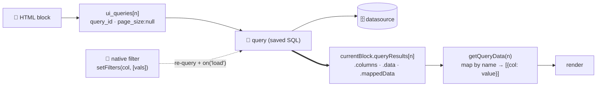

# 04 · Authoring Blocks

An HTML block is a self-contained HTML/JS/CSS surface on a page. This is the craft doc; the machine
rules that guard it are in [05 · Authoring Rules](05-authoring-rules.md), and the runtime API you call
inside a block is in [08 · zPortal In-Block API](08-zportal-in-block-api.md).

## The two-field structure
A block has **two separate fields** — never one HTML document:
- **HTML + JS** → `json_data.html` (an array of strings the server joins). Body-level markup only:
  **no** `<!DOCTYPE>/<html>/<head>/<body>`, and **no `<style>`** (CSS goes in the other field).
- **CSS** → `css` (string or line array).

Also in `json_data`: `isolated` (boolean). In practice blocks use **`isolated: false`** — they share
the page DOM and `window` (so cross-block APIs and shared chart libs work). Set `isolated: true` only
to sandbox a block in its own iframe — it then can't see the page's `window`/cross-block state; rarely
needed. Wrap markup in a single `.wrapper` and scope CSS under it; **wrap JS in an
IIFE** so nothing leaks to `window`. When several similar blocks share a page, suffix ids/classes/vars.

```html
<div class="hc-wrapper">
  <div id="hc-chart"></div>
  <script>(function () { /* IIFE — locals don't leak */ })();</script>
</div>
```

## Reading data: `currentBlock.queryResults`
`currentBlock` is injected and valid **synchronously** at load — don't poll. Query data is on
`currentBlock.queryResults[n]`, one entry per bound query (`queryResults[n]` ↔ `ui_queries[n]`).

Confirmed shape (v1.18/1.19):
- `.columns` — array of column-name **strings**.
- `.data` — array of **positional row arrays** (`[[v0, v1, …], …]`), native types.
- `.mappedData` — those rows already as `{column: value}` **objects** — prefer it. Populated by
  1.18+/1.19 portals; the helper below falls back to mapping `.columns`+`.data` on older builds.

Use one helper and map by name (never hardcode indices — a column-name mismatch is the #1 cause of an
empty block):
```js
function getQueryData(i = 0) {
  const q = currentBlock.queryResults && currentBlock.queryResults[i];
  if (!q) return [];
  if (Array.isArray(q.mappedData)) return q.mappedData;
  const cols = (q.columns || []).map(c => (typeof c === 'object' ? c.name : c));
  return (q.data || []).map(r => Object.fromEntries(cols.map((c, j) => [c, r[j]])));
}
```
> Deprecated aliases (still work): `currentBlock.data` / `.columns` = `queryResults[0]`; `siteConfig`
> → use `currentBlock.config`. Author with `queryResults`.

## Binding data: `ui_queries` → query → datasource
A block has **no `data` field**. It binds via `ui_queries`:
```json
"ui_queries": [{ "enabled": true, "page_size": null,
  "query_id": "<query-uuid>", "filter_strategy": { "type": "blacklist", "value": [] } }]
```
- `query_id` points to a saved **query** resource that already has a **datasource** (a query with no
  datasource is rejected: *"a query must have a datasource"*).
- `page_size`: **`null` = all rows** (preferred). A number caps rows (the UI default of 50 truncates).
- `filter_strategy: {type:"blacklist", value:[]}` = listen to all native filters (cross-block).
- Aggregate (GROUP BY / SUM / COUNT) in the **query SQL**, not in block JS, when the dataset is large.
- On `update_block`, **omit `ui_queries` to preserve the binding**; passing it replaces, `[]` unbinds.

Fastest path: `bind_block_query` with a `datasource_id` auto-creates a `SELECT *` query and links it.

### The data path at a glance

A block **binds** down to a datasource and **reads** the rows back synchronously — a native filter re-runs the query and refreshes every bound block:



*Solid = binding/resolution; the thick arrow is the data coming back. Map columns **by name**, never by index — a column-name mismatch is the #1 cause of an empty block.*

## The reliable build flow
1. **Discover** — `list_resource datasource` / `query`; `fetch_sample_rows` or `execute_query` to see
   **real column names** and values.
2. **Query** — reuse or `create_resource query` (one shared query several blocks bind to keeps a page
   consistent and filterable together).
3. **Author** — two fields, `.wrapper` scoping, IIFE, `getQueryData`, theme tokens, the house
   [design system](06-design-system.md).
4. **Create** — `create_block` (runs `validateBlock`).
5. **Bind** — `bind_block_query` (or pass `ui_queries` in `create_block`).
6. **Place** — `add_block_to_page` (or build the grid via `update_resource` on the layout).
7. **Verify** — load the page; confirm live rows flow (a hardcoded fallback can mask a bad binding).

## Reacting to filters (cross-block interactivity)
Native filters re-query the datasource and refresh every bound block. Subscribe and re-render:
```js
zPortal.dataSource.on('load', DS_ID, render);   // keep the ref; .off(DS_ID, render) to detach
```
A filter control sets `zPortal.dataSource.setFilters('region', ['West'])` and **every** block bound to
that datasource updates. See [08](08-zportal-in-block-api.md).

## Async blocks (charts, library loads)
For library loads / fetch / deferred render, obtain `currentBlock.getOnLoadedCallback()` early and call
it **once** after render (in a `finally`) or the page loader can hang. Load libraries via
`zPortal.resources.load(url)` — external `<script src>` is stripped. Dispose prior chart instances on
re-render (the script re-runs each reload). See [charting in 08](08-zportal-in-block-api.md).

## Critical gotchas (these silently break blocks)
- **A literal `$`** next to a quote/backtick/`&`/`$`/digit is mangled by AngularJS `$compile` and
  throws a SyntaxError that blanks the **whole block**. Use `value.toLocaleString('en-US',
  {style:'currency',currency:'USD'})`, `String.fromCharCode(36)` (JS), or `&#36;` (HTML). **Enforced**
  by the `no_raw_dollar` rule `[2.2.0]` (hard error). Template-literal `${…}` and jQuery `$(` are fine.
- **`{{ }}`** is evaluated by `$compile` — escape literal braces as `&#123;&#123;` or set via JS.
- **Multi-block pages:** isolate JS in IIFEs; load a heavy chart lib in **one** block per page (loading
  it in several racing blocks can corrupt `window.define`). Suffix ids/classes across blocks.
- **Column mismatch:** block column constants must equal the query's real aliases exactly.
- **Don't poll** (`setInterval`/`DOMContentLoaded`) for data — it's ready when the script runs.
