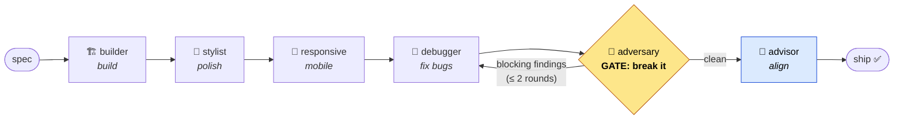

# 13 · Agents & Workflows

The MCP server gives Claude the **tools**; the repo's `.claude/` directory gives it a **team of
specialists and a process** for using them well. When this repo is your Claude Code working directory,
you don't drive `create_block`/`bind_block_query`/`update_block` by hand — you describe what you want,
and a gated pipeline of subagents builds, styles, hardens, and reviews it for you.

> **Works when this repo is your Claude Code working directory.** Per-project portal credentials live in
> `./.zuar-portal/config.json` — run **`/portal-setup`** once per folder (see
> [02 · Install & Configuration](02-install-and-config.md) for the multi-portal config model). Agents
> read the live portal plus `assets/conventions.md` (the enforced authoring rules) and `assets/design.md`
> (the house visual system) — they don't guess.

## The block pipeline

Blocks are **never shipped raw**. A spec flows through quality gates, each one a specialist agent that
does one job and hands off to the next:

*The **adversary** and **advisor** (blue) are read-only — they carry no write tools and physically cannot
mutate the portal. The adversary (amber) is the **gate**: while it returns blocking findings, the pipeline
loops back to the debugger, bounded to two rounds.*

- **builder** discovers the datasource, verifies the real columns, authors the two-field block, binds it
  via `ui_queries`, validates, and creates it — correct and on real data.
- **stylist** applies `assets/design.md`: hierarchy, color, type, spacing, elevation.
- **responsive** adds breakpoints, fluid grids, touch targets — no overflow at any width.
- **debugger** hunts the runtime footguns (the `$` trap, the AMD/`window.define` race, the `queryResults`
  shape, dropped `:root` tokens, a missing loaded-callback, re-render leaks) and verifies live data flows.
- **adversary** is the **gate** — a read-only red team that tries to break the block and proves each
  finding with evidence (`execute_query` column diffs, `validate_block`). While it returns blocking
  findings, the pipeline **loops back to the debugger** (bounded — max two fix rounds in the workflow).
- **advisor** is the final read-only alignment check: is this the *right* block for the business question,
  the audience, and the data shape?

**Why the gates matter.** A block can look perfect in a happy-path demo and blank out (or quietly lie) on
real data — a column constant that drifted from the bound query's alias, a `page_size` that truncates, a
`$` that corrupts the injected script. Each stage has an **output contract** (a typed handoff carrying the
`block_id`, the bound `query_id` + exact columns, and notes) so the next stage builds on real state
instead of re-discovering it — and never runs a second `update_block` on a block it didn't read first.

## The agent roster

Ten agents live in `.claude/agents/`. The six **pipeline** agents run in sequence above; four **domain
specialists** handle broader jobs. The **read-only** agents (adversary, advisor) carry **no write tools** —
they inspect, reproduce, and report; they cannot mutate the portal.

| Agent | Role | Triggers |
|-------|------|----------|
| **portal-block-builder** | Authors the block: discovers data, verifies columns, binds `ui_queries`, validates, creates. Correct + real-data. | First stage of a build; "build me a block". |
| **portal-block-stylist** | Applies `assets/design.md` — hierarchy, color, type, spacing, elevation — without breaking JS or the binding. | After the builder, in `/portal-build`. |
| **portal-responsive-specialist** | Breakpoints, fluid grids, mobile/touch, no overflow. Preserves the binding. | After the stylist; "make it responsive". |
| **portal-block-debugger** | Fixes the runtime footguns and confirms live rows flow; re-validates and updates preserving `ui_queries`. | After responsive; each adversary loop-back. |
| **portal-block-adversary** *(read-only gate)* | Red-teams the block to break it; returns severity-ranked findings + a `ship`/`needs-fixes` verdict. No write tools. | The gate before ship; every audit. |
| **portal-block-advisor** *(read-only)* | "Is this the right block?" — business question, metric correctness, viz fit, altitude. Recommends, never writes. | Final alignment gate; every audit. |
| **portal-data-expert** | The data brain — profiles datasources/queries, recommends viz + aggregations, validates bindings, designs filters. | Data discovery; binding/metric questions. |
| **portal-theme-designer** | Portal-wide theming — tokens, light/dark, brand alignment, applying a theme across blocks. | `/portal-theme`; "theme the portal". |
| **portal-bulk-operator** | Safe bulk changes across many blocks/pages — snapshot-first, dry-run, atomic `set_page_blocks`. | `/portal-bulk`; "change all the …". |
| **portal-onboarding** | The alignment Q&A — learns the user, business, portal and data, writes the project config + a shared brief. | First on a new engagement; `/portal-setup`, `/portal-align`. |

## Slash commands

Each command is a guarded entry point in `.claude/commands/`. The build/theme/bulk/audit/align commands
first confirm a portal is connected (`active_config`) and send you to `/portal-setup` if not.

| Command | What it does |
|---------|--------------|
| **`/portal-setup`** | First-time, per-folder setup: connect this directory to a portal and run the alignment Q&A → writes `.zuar-portal/config.json` + a project brief. |
| **`/portal-build`** *`<spec>`* | Runs the full build → style → responsive → debug → adversary → advisor pipeline for one block. |
| **`/portal-theme`** *`<goal>`* | Designs or applies a portal-wide theme via the theme-designer. |
| **`/portal-bulk`** *`<change>`* | A guarded bulk change across many blocks/pages (snapshot → dry-run → atomic apply). |
| **`/portal-audit`** *`[filter]`* | Read-only audit of existing blocks for bugs, a11y, responsiveness, and design fit — fixes nothing. |
| **`/portal-align`** | Runs the alignment Q&A on its own (business / portal / data discovery), no credential changes. |

## Skills

The repo carries three **thin** skills in `.claude/skills/` that encode the *process* and **point at** the
rich global skills (`zportal`, `currentblock`, `decompose-html-to-zportal-blocks`, `db-modifications`)
rather than duplicating them. See [09 · Related Skills](09-related-skills.md) for the global catalog.

| Skill | What it carries |
|-------|-----------------|
| **`portal-block-pipeline`** | The gated build map (which agent runs when, the output-contract handoff); the orchestration layer over the global authoring skills. |
| **`portal-responsive`** | Repo recipes for breakpoint/collapse behavior on top of `assets/design.md`; pairs with the responsive specialist. |
| **`portal-bulk-ops`** | The snapshot/validate/restore discipline for many-resource changes; pairs with the bulk operator. |

## Workflows

`.claude/workflows/` holds two deterministic, multi-agent orchestration scripts run via the **`Workflow`**
capability (and referenced by the commands). They fan agents out and synthesize their typed results:

- **`portal-block-pipeline.js`** — a hands-off gated build of one block. It runs the stages in sequence
  (they all mutate one block, so never in parallel), then **loops the adversary↔debugger** while the gate
  returns blocking findings (bounded to two rounds), and ends with the advisor. Returns the `block_id`,
  bound query, fix-round count, the chosen `tier`, and the adversary/advisor verdicts.
- **`portal-audit.js`** — fans the **adversary + advisor across every block in parallel** (capped, with an
  optional name filter), flattens and severity-ranks the findings (blocking first), and asks an agent to
  write a ranked report. The report's blocking/major items map to block ids and suggested fixes you can
  feed straight into `/portal-build`'s debugger stage.

Both accept a **`tier`** in `args` (`fast` \| `standard` \| `max`) to dial cost vs. quality across the
whole run — see [Model & effort routing](#model--effort-routing) below.

## Model & effort routing

Each agent runs on the **model and reasoning effort** that fit its job — sharp where judgment matters,
cheap where the work is mechanical. Routing has three composing layers.

**1 · Agent defaults** (`model:` / `effort:` in each agent's frontmatter) — the model for a *direct* call
(a quick surgical edit, or one agent dispatched from a command):

| Tier | Agents | Model · effort |
|------|--------|----------------|
| 🧠 **Judgment / data** | `portal-data-expert`, `portal-block-adversary`, `portal-block-advisor` | **`opus` · high** |
| 🛠️ **Authoring** | `portal-block-builder`, `portal-block-stylist`, `portal-block-debugger`, `portal-bulk-operator`, `portal-theme-designer`, `portal-onboarding` | **`sonnet` · medium** |
| ⚡ **Mechanical** | `portal-responsive-specialist` | **`haiku` · low** |

**2 · Workflow `tier` toggle** — `portal-block-pipeline.js` and `portal-audit.js` accept
`args:{ …, tier }` (`fast` \| `standard` \| `max`, default `standard`) and set **each stage's** model/effort
*explicitly*, so the routing holds regardless of the session model:

| `tier` | Reach for it when… | Builders | Judgment gates |
|--------|--------------------|----------|----------------|
| **`fast`** | cheap iteration, throwaway drafts, large-set triage | `sonnet`/`haiku` · low | `sonnet` · medium |
| **`standard`** *(default)* | a normal build / audit | `sonnet` · medium | **`opus` · high** |
| **`max`** | production / executive build, pre-release audit | **`opus` · high** | **`opus` · xhigh** |

**3 · Command orchestration** — the six `/portal-*` commands pin to **`sonnet` · medium**. They only
orchestrate (pre-flight → dispatch → synthesize); the quality lives in the agents and workflow stages they
call. `/portal-build` and `/portal-audit` infer the workflow `tier` from how you phrase the request
("rough sketch" → `fast`, "make it production-grade" → `max`).

> **Re-tiering.** Change `model:`/`effort:` in an agent's frontmatter (its single-shot default) or the
> `ROUTING` table at the top of a workflow (per-stage). Valid models: `opus`, `sonnet`, `haiku`, `fable`,
> or a full model id; effort: `low | medium | high | xhigh | max`. The MCP **server** never selects a
> model — only the agents, commands, and workflows that drive it do. See
> [`.claude/README.md`](../.claude/README.md) for the authoritative table.

## Automation & loops

The pipeline is one-shot; loops and schedules drive it (and read-only checks) repeatedly. See
[11 · Loops & Automation](11-loops-and-automation.md) for the patterns and safety net — in brief:

- **Nightly audit.** Use the **`/loop`** skill (or **`/schedule`** for a cron routine) to run
  `/portal-audit` on a cadence and surface a fresh ranked findings report each morning — read-only, so it
  never writes.
- **Scheduled checkpoint.** A `/schedule` routine that runs `snapshot_portal` daily commits the current
  portal state (even edits made in the portal UI), a cheap durable safety net — see
  [11](11-loops-and-automation.md) and [07 · Version Control](07-version-control.md).
- **Recurring cloud runs.** `/schedule` runs routines on a cron in the cloud; reach for it over a tight
  `/loop` for anything idle/periodic.

## Safety

The agents inherit the server's [write-safety model](02-install-and-config.md):

- **Content writes are revertible.** With [version control](07-version-control.md) configured, every
  block/page/query/theme write an agent makes is mirrored to the VC git repo — revert any change with
  `restore_resource` (or `git reset` in that repo). Snapshot before a big batch.
- **Data and admin writes stay opt-in.** SQL (`run_db_modification`, still needs `confirm:true`) and
  users/security writes require the `PORTAL_ALLOW_DATA_WRITES` / `PORTAL_ALLOW_ADMIN_WRITES` flags;
  content/block writes are on by default.
- **The read-only gates can't write at all.** The adversary and advisor carry no write tools, so the
  review stages physically cannot mutate the portal.
