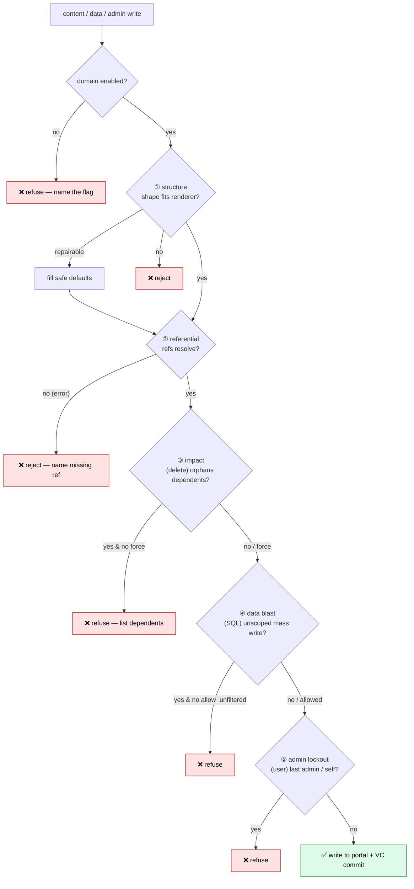

# 16 · Safety & Integrity Gates

> The portal's own API under-validates — it will happily store a record that
> crashes itself (that's how the "all pages vanished" incident happened). So the
> MCP acts as the **strict schema- and safety-enforcement layer the portal
> lacks.** Every write is checked, in code, at a single chokepoint that no tool
> or agent can skip. This page documents the full safety surface. **`[2.6.0]`**
>
> The narrower structural story (the incident that started this) is in
> [15 · Structural Integrity Gate](15-structural-integrity.md); this page covers
> the whole system that grew from it.

## The five guard classes

| # | Class | What it stops | Where |
|---|-------|---------------|-------|
| 1 | **Structure** | A record whose shape breaks the renderer (page/partial missing `grid.layouts`; theme with non-array `css`) | `structure.ts`, at the write chokepoint |
| 2 | **Referential** | A write pointing at a record that doesn't exist (page→deleted block, block→deleted query, query→deleted datasource) | `safety.ts` + chokepoint / block tools |
| 3 | **Impact** | A delete that orphans dependents (delete a block on 3 pages, a datasource 6 queries use, the default-dashboard page) | `safety.ts` + `delete_resource`/`delete_block` |
| 4 | **Data blast** | An unscoped mass write (UPDATE/DELETE with no WHERE, TRUNCATE, DROP) | `safety.ts` + `run_db_modification` |
| 5 | **Admin lockout** | Removing the last admin, or deleting/demoting your own account | `safety.ts` + `delete_resource`/`update_resource` |

Two modules back these: **`structure.ts`** (does this one record's *shape* fit?)
and **`safety.ts`** (is this operation *safe given the rest of the portal*?). The
`safety.ts` functions are pure (the data lookups are injected), so they're unit
tested with no network — see `test/safety.test.ts` and `test/structure.test.ts`.

Every write runs the gauntlet at one chokepoint — repaired where possible, refused where not, before anything reaches the portal:



## 1 · Structure (auto-repair, then hard-reject)

Covered in depth in [doc 15](15-structural-integrity.md). Contracts exist for
**layout**, **partial** (global chrome — same render contract as a page, one
level up), **theme** (token map is an object, `css` is an array), and **query**
(datasource binding is `[{id, alias}]`). The gate first fills safe defaults
(never overwriting caller intent), then refuses anything still incompatible.

## 2 · Referential integrity

A write must not introduce a reference to a record that doesn't exist — a
dangling reference renders blank or broken. Checked references:

| Resource | Field | Must resolve to |
|----------|-------|-----------------|
| layout | `json_data.grid.blocks[]` | a real block |
| partial | `json_data.blocks[]` | a real block |
| block | `ui_queries[].query_id` | a real query |
| query | `datasources[].id` | a real datasource |
| system | `default_dashboard` / `theme_id` value | a real layout / theme |

Only **caller-introduced** references are checked — the body the caller passed,
never the merged record — so an unrelated edit to a record that *already* had a
dangling reference is never blocked. Posture is set by **`PORTAL_REF_INTEGRITY`**:

- `error` (default) — refuse the write, naming the missing reference.
- `warn` — allow but log it.
- `off` — skip the check.

A refusal is actionable: *"create the referenced record first, fix the id, or set
`PORTAL_REF_INTEGRITY=warn`."*

## 3 · Pre-delete impact analysis

Before a delete, the server computes who **depends** on the target and refuses to
orphan them unless you pass **`force: true`**:

- delete a **block** → refused if any page/partial places it
- delete a **datasource** → refused if any query reads it
- delete a **query** → refused if any block is bound to it
- delete a **layout** → refused if it is the portal default dashboard
- delete a **theme** → refused if it is the portal's active theme

The refusal lists each dependent and how it depends, so you can reassign first or
re-run with `force: true` (which deletes anyway and leaves the references
dangling — the referential check will then flag those on the next edit).

## 4 · Data blast radius (`run_db_modification`)

`run_db_modification` already needs `PORTAL_ALLOW_DATA_WRITES=1` + `confirm:true`.
On top of that it now inspects the saved SQL and **refuses an unscoped mass write**
— an `UPDATE`/`DELETE` with no `WHERE`, or a `TRUNCATE`/`DROP` — unless you pass
**`allow_unfiltered: true`**. Detection strips comments and string literals first,
so a `WHERE` inside a quoted string doesn't count as scoped, and a parameterised
`WHERE :id` does. `validate_portal` also reports risky SQL in saved
db_modifications so you can find them before anyone runs them.

## 5 · Admin lockout protection

User mutations (via `delete_resource` / `update_resource` on the `user` resource)
are refused when they would:

- **delete the last admin** — the portal would have no administrator, or
- **delete your own account**, or
- **demote the last admin** (`admin: false`), or
- **remove admin from your own account**.

These are hard rails (admin writes also require `PORTAL_ALLOW_ADMIN_WRITES=1`).

## `validate_portal` — the proactive sweep

The incident sat latent for three days before anyone noticed. **`validate_portal`**
is the read-only complement to the write-time gate: it sweeps every layout,
partial, theme, query, block, db_modification and system record and reports

- **malformed / missing-structure** records (would break the renderer),
- **dangling references**, and
- **unscoped mass-write SQL**,

with per-type counts and a `healthy` flag — fixing nothing. Run it after bulk
changes, before a release, or on a schedule (it pairs naturally with the loop /
cron tooling — see [11 · Loops & Automation](11-loops-and-automation.md)) so
latent breakage is caught before users hit it.

```
validate_portal            → { healthy, issue_count, by_type, scanned, issues }
validate_portal limit=20   → same, capped to the first 20 issues
```

## Configuration summary

| Env / flag | Effect | Default |
|------------|--------|---------|
| `PORTAL_REF_INTEGRITY` | `error` \| `warn` \| `off` for referential checks | `error` |
| `force: true` (delete tools) | delete despite dependents | off |
| `allow_unfiltered: true` (`run_db_modification`) | run an unscoped mass write | off |
| `PORTAL_ALLOW_DATA_WRITES` / `PORTAL_ALLOW_ADMIN_WRITES` | enable data / admin writes at all | off |

## Design rules (for extending this)

- **One chokepoint, forever.** Every content write goes through
  `createResource`/`updateResource`. Never add a write path that skips them.
- **Pure + additive + idempotent.** Normalisers operate on a copy, only fill
  missing structure, and `normalize(normalize(x)) === normalize(x)`.
- **Fail closed on writes, open on reads.** A safety doubt blocks a write; a
  failed *lookup* (e.g. the dependents fetch) logs and is skipped rather than
  hard-failing a legitimate operation — the structural gate and the portal still
  apply.
- **Every contract gets a golden test**, including one that reproduces the exact
  bad shape it defends against.
