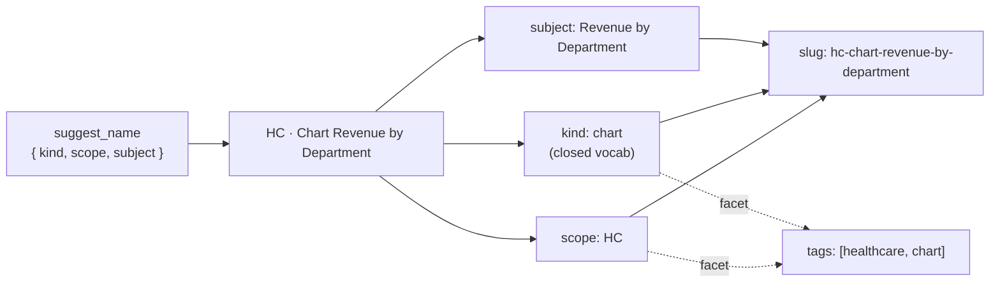

# 17 · Naming & Tagging Convention `[2.7.0]`

A portal accretes blocks, pages, queries, datasources, themes, and tags faster than anyone
re-reads them. Without a convention, a name answers only *what it means* ("Revenue Chart")
and forces every human and tool to guess *where it lives* and *what it is*. This convention
makes names **structured and parseable** so those two questions stop being guesswork.

> Surfaced live by `get_rules` (the `conventions` text) and the `suggest_name` / `parse_name`
> tools. The grammar is also enforced (softly) by the `naming_*` authoring rules — see
> [05 · Authoring Rules](05-authoring-rules.md).

## The rule, in one line

> A name is a structured slug that encodes **scope → kind → subject**, with `kind` drawn
> from a closed vocabulary, and any identifier in a shared namespace (CSS classes, URL
> slugs) owned/scoped so it can't collide.

## The grammar

```
SCOPE · Kind Subject            (display name — Title Case, " · " separated)
scope-kind-subject              (machine slug — kebab, derived, stable)
```

- `·` (middle dot) separates the **scope** segment from the **kind + subject** phrase;
  words inside a segment are spaces (display) or dashes (slug).
- `kind` is identified by **membership in the closed vocabulary**, not by position — so the
  phrase stays human-readable (`HC · Chart Revenue by Department`, not `HC · revenue__chart`).

| Level | Example display name | scope | kind | subject |
|-------|----------------------|-------|------|---------|
| KPI block | `HC · KPI Band` | HC | kpi | — |
| Chart block | `FIN · Chart Band` | FIN | chart | Band |
| Named chart | `HC · Chart Revenue by Department` | HC | chart | Revenue by Department |
| Table block | `RT · Detail Table` | RT | table | — |
| Utility block | `SYS · amCharts Loader` | SYS | — | amCharts Loader |
| Page | `Industry Showcase · Healthcare` | — | — | (readable section name) |



*The name encodes the tree (scope → kind → subject); tags encode the flat, cross-cutting facets. `suggest_name` derives the slug and tags so they stay consistent.*

### Vocabularies

**Scope codes → facet tags** (terse code heads the display; the tag is the flat facet):

| Code | Tag | Code | Tag |
|------|-----|------|-----|
| `HC` | healthcare | `CRM` | crm |
| `FIN` | financial | `MKT` | marketing |
| `SC` | supply-chain | `EXEC` | executive |
| `RT` | retail | `SYS` | system |
| `IOT` | iot | | |

**Kinds (closed):** `kpi · chart · table · filter · hero · navigation · map · text` (plus
the resource kinds `page · partial · query · datasource · theme · group`).

These are built-in defaults (seeded from a real portal) living in `src/naming.ts`. They are
*data, not logic*, so a future per-project `naming` config block can override them.

## The two tools

| Tool | Use |
|------|-----|
| **`suggest_name`** | Generate the display name + slug + facet tags from `{kind, scope?, subject?, qualifier?}`. `scope` accepts a code (`HC`) or a tag (`healthcare`). **Prefer this over hand-naming** — it removes the fat-finger error class and keeps slugs/tags consistent. |
| **`parse_name`** | Decompose a name into `{scope, kind, subject, slug, conforms}` to audit/grade an existing name. |

```
suggest_name { kind:"chart", scope:"healthcare", subject:"Revenue by Department" }
  → { display_name:"HC · Chart Revenue by Department", slug:"hc-chart-revenue-by-department",
      tags:["healthcare","chart"], scope:"HC", kind:"chart" }
```

## The invariants that actually prevent bugs

Enforce the ones that prevent failures; *suggest* the cosmetic ones.

1. **CSS is owner-scoped (enforced: `naming_css_scope`=warn).** A block must not leak global
   selectors — `:root{}`, `*`, bare `body`/`html` — onto the shared page DOM, where they
   clobber sibling blocks. A family-prefixed class shared with an *identical* body is fine;
   the real collision is a *divergent* shared class. (This is the refined check: naive
   "every class must be block-prefixed" would false-positive on legitimate family prefixes.)
2. **Slugs are stable contracts.** Rename a display title freely; never churn a page's URL
   slug — it backs `/p/slug` links and `?dim=value` cross-page drill-through.
3. **Tags MERGE, never replace.** A tag can be functional (a `Menu` tag may drive nav
   membership). `update_block` takes `merge_tags:true`; `mergeTags()` is the helper.

The block-name pattern itself (`naming_block_name`) is **off by default** — it's
project-specific, so opt in via `rules.json` if your portal adopts it.

## Names vs. tags

Names encode the **tree** (one canonical, structured value — identity/scope/kind); tags
encode the **facets** (many, flat, cross-cutting — discovery). Tag a block with its scope
facet + kind facet (`[healthcare, kpi]`) so you can slice *across* the tree — every KPI, or
every chart, regardless of industry. Don't smuggle kind into a tag-only scheme or facets
into the name.

## Behavioral fixes this convention shipped

Three findings from a live rename/tag pass over a real portal, now fixed in the server:

1. **Metadata-only writes skip content validation.** `update_block` now validates only the
   fields the caller changed — a rename/retag is no longer blocked by a *pre-existing* rule
   violation in stored content the caller never touched (e.g. a legacy literal `$`).
2. **A datasource/db_modification rename is content-risk, not data-risk.** An update touching
   only `name`/`tags` (no `sql`/connection) is gated as `content`, so it doesn't require
   `PORTAL_ALLOW_DATA_WRITES`. See `effectiveUpdateDomain` in `resources.ts`.
3. **Opt-in tag merge** via `update_block { merge_tags:true }` — preserves functional tags.

## Datasources & data assets (the data profile) `[2.8.0]`

Datasources and queries follow a **profile** of the same grammar tuned for data:

```
SCOPE · Subject — Source        (display)
scope-subject-source            (slug)
tags: [scope-tag, kind-tag, source-tag]
```

- **Drop the kind word.** A datasource/query/page/partial/theme/group is a *resource kind* — the record
  type is already known from the list you're looking at, so the name is `DW · Dim Customer`, **not**
  `DW · Datasource Dim Customer` (exactly how pages are named `Industry Showcase · Healthcare`). The kind
  still becomes a facet tag. `suggest_name` does this automatically for the resource kinds.
- **Source facet** — the one fact a dataset hides is *can I trust it in production?* Make it visible with a
  closed vocabulary, as a `— <Source>` suffix **and** a tag:

  | Source tag | Marker | Means |
  |------------|--------|-------|
  | `sample` | `— Sample` | synthetic / demo / seed data (replaces ad-hoc `(dummy)`, `RANDOM *`, `-SAMPLE`) |
  | `live` | *(none)* | real connected operational data — the unmarked default |
  | `telemetry` | `SYS ·` scope | the portal's own usage / audit data |
  | `curated` | `(Joined)` etc. | a derived / modeled view, not a raw table |
  | `reference` | `— Reference` | static lookup / dimension data |

- **`DW` scope** = `data-warehouse` — a dedicated namespace for a conformed model (dims/facts/marts), kept
  distinct from per-industry sample blocks. Tag the layer too (`dimension` / `fact`).

```
suggest_name { kind:"datasource", scope:"DW", subject:"Dim Customer" }
  → { display_name:"DW · Dim Customer", slug:"dw-dim-customer", tags:["data-warehouse","datasource"] }
suggest_name { kind:"datasource", scope:"healthcare", subject:"Clinical Encounters", source:"sample" }
  → { display_name:"HC · Clinical Encounters — Sample", tags:["healthcare","datasource","sample"] }
```

> Hygiene: a datasource must **never be named after its connection string** — a name like
> `postgresql://root:s0secret@db/portal` leaks the password into every list and log. `validate_portal`
> flags this (`secret_in_name`); rename it AND rotate the credential.

## Generate, don't transcribe

The highest-leverage habit: ask `suggest_name` for the name instead of typing it. A live
bulk pass fat-fingered two UUIDs precisely because names/ids were hand-copied; a generator
removes that class of error and guarantees the slug + tags are derived consistently.
