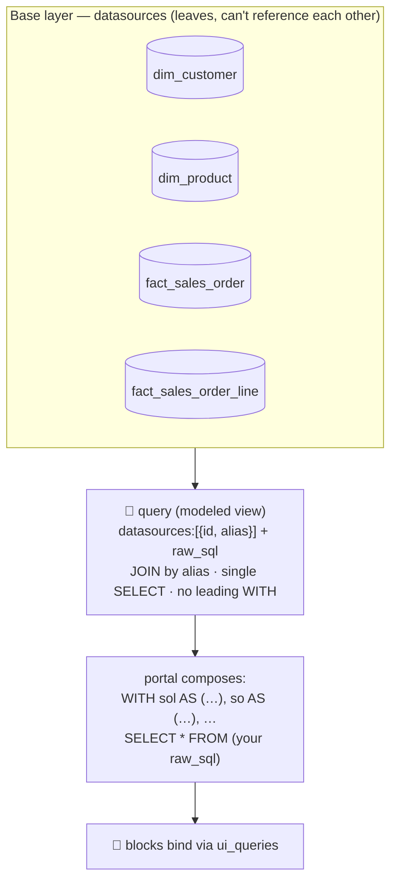

# 18 · Data Modeling — datasources + a modeled query layer `[2.8.0]`

How to turn a pile of tables into a **ready data model**: raw tables as datasources, and the
joins/rollups as a query layer on top. Proven building the `DW` (company) warehouse — 22 base
datasources + 20 modeled queries.

## The two layers

| Layer | Resource | Role |
|-------|----------|------|
| **Base tables** | `datasource` | One per table — raw SQL (or a `SELECT` generator). Profileable (`profile_datasource`), sampleable (`fetch_sample_rows`). |
| **Modeled views** | `query` | Joins/aggregations over the base datasources — the semantic layer blocks bind to. |

A datasource is a **leaf**: its SQL can't reference another datasource. Composition happens in the
**query** layer, which references datasources by alias.



*Composition happens in the **query** layer, not the datasource — each declared datasource is injected as a CTE named by its alias.*

## Modeling joins as queries

A `query` can reference **multiple** datasources and join them in `raw_sql`:

```json
create_resource { "resource": "query", "body": {
  "name": "DW · Sales Order Lines (Enriched)",
  "datasources": [
    { "id": "<fact_sales_order_line>", "alias": "sol" },
    { "id": "<fact_sales_order>",      "alias": "so"  },
    { "id": "<dim_customer>",          "alias": "c"   },
    { "id": "<dim_product>",           "alias": "p"   }
  ],
  "raw_sql": "SELECT so.order_date, c.segment, p.category, sol.quantity, round((sol.quantity*sol.unit_price*(1-sol.discount_pct))::numeric,2) AS net_amount FROM sol JOIN so ON sol.sales_order_id=so.sales_order_id JOIN c ON so.customer_id=c.customer_id JOIN p ON sol.product_id=p.product_id",
  "default_params": []
}}
```

**How the portal composes it (and the rule that follows):** each declared datasource is injected as a
CTE, then your SQL is wrapped as a subquery:

```sql
WITH sol AS (SELECT * FROM (<sol datasource sql>) AS anon),
     so  AS (SELECT * FROM (<so  datasource sql>) AS anon),
     ...
SELECT * FROM (<your raw_sql>) AS anon
```

So:

- **`raw_sql` must be a single `SELECT` with NO leading `WITH`.** Need pre-aggregation? Use a derived
  subquery in the `FROM`/`JOIN`, not a CTE:
  ```sql
  SELECT c.customer_id, COALESCE(s.net_revenue,0) AS net_revenue
  FROM c
  LEFT JOIN (SELECT so.customer_id, sum(...) AS net_revenue
             FROM sol JOIN so ON sol.sales_order_id=so.sales_order_id
             GROUP BY so.customer_id) s ON c.customer_id=s.customer_id
  ```
- **Aliases become CTE names** — pick valid identifiers (`sol`, `so`, `c`, …).
- A base datasource's `%` (modulo) renders as `%%` in the composed SQL (format-string escaping) — this
  is harmless; don't "fix" it.
- `query` is **content-domain** — no `PORTAL_ALLOW_DATA_WRITES` needed, and it's version-controlled.
- Verify with `execute_query` (cap with `limit`) — the create also introspects `columns`, so a non-empty
  `columns` array means the SQL parsed and ran.

A good model ships both **row-level enriched marts** (fact ⋈ dims, with computed columns: margin,
days-overdue, weighted amount, CTR/CPA, below-reorder) and **aggregate rollups** (by month / category /
region / rep / supplier / campaign, plus a customer-360).

## PostgreSQL gotcha — `date ± bigint`

The portal's Postgres has **no `date - bigint` / `date + bigint` operator** (only `date ± int`). A
common synthetic-data idiom — `CURRENT_DATE - (('x'||substr(md5(salt||k::text),1,8))::bit(32)::bigint % N)`
— produces a **bigint** offset and is rejected at `create_resource` with
`operator does not exist: date - bigint`.

**Fix:** cast the modulo result to int — `… % N)::int` — *after* the modulo, never the raw bigint (the
`bit(32)::bigint` can reach 2³², which overflows `int4`; the `% N` result is always small). An integer
literal offset (`CURRENT_DATE - 1095`) is fine as-is.

## Naming & hygiene

- Name base datasources and modeled queries with the **data profile** (see
  [17 · Naming](17-naming-convention.md)): `SCOPE · Subject — Source`, dropping the kind word, e.g.
  `DW · Dim Customer`, `DW · Sales by Category`. Tag the warehouse (`data-warehouse`) and layer
  (`dimension` / `fact`); mark synthetic data with the `sample` source facet.
- **Never name a datasource after its connection string** — it leaks the password. `validate_portal`
  flags `secret_in_name`; rename AND rotate the credential.

## Version control & rollback

Datasources are now mirrored to version control alongside content `[2.8.0]` — both per-write and via
`snapshot_portal`. To roll back a bulk model load, delete by tag (e.g. `data-warehouse`) or restore from
the VC repo. (Admin resources are never mirrored — they can carry secrets.)
